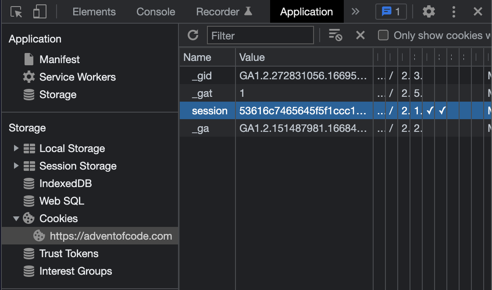

<h1 align="center">
	Framework for solving 🌟 Advent of Code 🎄
</h1>

<p align="center">
	
	
	
	
	
</p>

<h3 align="center">
	<a href="#%EF%B8%8F-about">About</a>
	<span> · </span>
	<a href="#%EF%B8%8F-usage">Usage</a>
	<span> · </span>
	<a href="#-contents">Contents</a>
	<span> · </span>
	<a href="#-what-is-advent-of-code">What is <i>Advent of Code</i>?</a>
</h3>

---

## 🗣️ About

This framework was developed to automate repetitive tasks when solving 🌟 Advent of Code 🎄 puzzles, such as:
- creating the necessary files for solving the puzzles of a given day;
- downloading one's personal input;
- reading and formatting the input text;
- running the solving code for a given day, both for one's personal input and testing inputs;
- testing of multiple different inputs.

Future improvements include: opening of the webpage of a given day puzzle.

## 🛠️ Usage

### Requirements

- `Python 3.10`
- `termcolor`
- `make` (for running `Makefile`)

### Instructions

0. [Git clone this repo into your AoC folder](#0-git-clone-this-repo-into-your-aoc-folder)
1. [Create the config.ini file](#1-create-the-configini-file)
2. [Create a new day folder from template](#2-create-a-new-day-folder-from-template)
3. [Fill in the input files](#3-fill-in-the-input-files)
4. [Write the solving code in the `main.py` file](#4-write-the-solving-code-in-the-mainpy-file)
5. [Run the puzzle solver](#5-run-the-puzzle-solver)

#### 0. Git clone this repo into your AoC folder

```shell
$ cd advent_of_code-2015/my_solutions
$ git clone https://github.com/appinha/aoc_framework.git
```

#### 1. Create the config.ini file

To enable automated downloading of your personal input from the AoC website, your AoC folder must contain a `config.ini` file with the following content:

```config
[aoc_settings]
year=2021
session_cookie=1234567890
```

The resulting folder structure should be:
```
my_solutions
  aoc_framework
    ...
  config.ini
```

_**Note:** to get your session cookie, open the AoC website and log in to your account; open DevTools (inspect) and go to the "Application" tab; on the left menu, under "Storage", click on "Cookies", then on the AoC url; from the table, copy the value of the "session" entry._



#### 2. Create a new day folder from template

Go into the cloned folder:

```shell
$ cd aoc_framework
```
and run:

```shell
$ make new day=01
```


_Note: the `make` commands have to be run from the cloned folder's root, i.e. from where the `Makefile` is placed._

The resulting folder structure should be:
```
my_solutions
  aoc_framework
    ...
  config.ini
  day_01
    input_test.txt
    input.txt
    main.py
    README.md
    solutions.txt
```

#### 3. Fill in the input files

For your **personal input**, upon creating a new day folder from template, it is automatically downloaded from the AoC website and pasted into the `input.txt` file.

If an error occurred while downloading your input upon creating the new day folder, you can try again with:

```shell
$ make input day=01
```

For **testing inputs**, add them in the `input_test.txt` file in substitution of the text `INPUT` and add the expected result in substitution of the `?` character. The line `<--->` is used to separate inputs for a given puzzle part, while the line `<===>` separates inputs from each puzzle part. In the example below, there are 3 testing inputs for part 1 and 2 testing inputs for part 2:

```
2x3x4
:-> solution=58 <-:

<--->

1x1x10
:-> solution=43 <-:

<--->

2x3x4
1x1x10
:-> solution=101 <-:

<===>

2x3x4
:-> solution=34 <-:

<--->

1x1x10
:-> solution=14 <-:
```

_(test inputs for AoC 2015 day 02 puzzle)_

#### 4. Write the solving code in the `main.py` file

The solving code for each part of the puzzle have to be written as the methods `solve_part_1` and `solve_part_2` of the `DayPuzzleSolver` class:

```python
class DayPuzzleSolver():
    def __init__(self):
        self.delimiter = ""

    def solve_part_1(self, raw_input):
        ...

    def solve_part_2(self, raw_input):
        ...
```

The `self.delimiter` parameter determines how the text from the input file should be broken down. The result is then passed as the `raw_input` parameter of the solving methods. For example:

- `""` (empty string) - the input text remains the same, i.e. `raw_input` will be a string containing the input text in whole.
- `"\n"` - to be used when the input should be broken down line by line, i.e. `raw_input` will be a list of strings (lines).
- `"\n\n"` - to be used when the input is written in blocks and should be broken down by so, i.e. `raw_input` will be a list of strings (blocks of lines).

#### 5. Run the puzzle solver

for a certain day (both parts):

```shell
$ make day=02
```


for a certain day and part:

```shell
$ make day=04 part=1
```

```shell
$ make day=08 part=2
```

for testing input:

```shell
$ make test day=12
```

```shell
$ make test day=12 part=1
```


## 📑 Contents

* `Makefile` - used for duplicating the day template folder and running the solver script for a given day.

### 📂 day_template

* `input_test.txt` - text file containing input from tests given in the puzzle.
* `input.txt` - text file containing my personal input for the puzzle.
* `main.py` - Python class that implements the code for solving the puzzle.
* `README.md` - markup file containing a summary and link to the puzzle.
* `solutions.txt` - text file containing the solutions for my personal puzzle input.

### 📂 solver

* `solve_day.py` - script for running the solving code for a given day.
* `timer.py` - contains the class `Timer` used for timing the puzzle solving.

## 🌟 What is *Advent of Code*?

	🚀 TLDR: an online event where a two-part programming puzzle is released each day from Dec 1st to the 25th.

[Advent of Code](http://adventofcode.com) is an online event created by [Eric Wastl](http://was.tl/). In his words:

> Advent of Code is an Advent calendar of small programming puzzles for a variety of skill sets and skill levels that can be solved in any programming language you like. People use them as a speed contest, interview prep, company training, university coursework, practice problems, or to challenge each other.

Source: https://adventofcode.com/about
